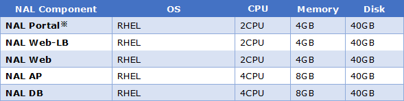
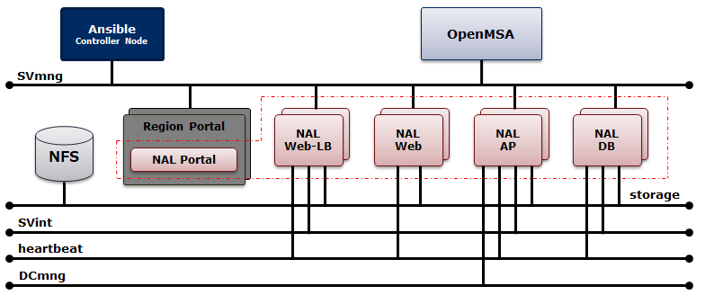

# Network Automation Layer (NAL) Auto Setup Tool

## Overview
These are the automation tools for NAL installation and testing.

This tool is based on Ansible and Selenium.

## Installation
This guide will cover the installation and configuration of NAL using the NAL-Automation Tool.

### ■ REQUIREMENTS 
#### (1)  An Ansible Controller Node

Setup and installation of **Ansible** is not covered in this document.
</br>Please prepare it in advance.

#### (2) An NFS Server 

Setup and installation of the **NFS Server** is not covered in this document.
</br>Please prepare it in advance.

#### (3) OpenMSA 

Setup and installation of the **OpenMSA** is not covered in this document. Please refer to the [OpenMSA Installation Guide](https://www.openmsa.co/documentation/getting-started-with-the-openmsa-freeware/)
</br>Please prepare it in advance.

#### (4) 10 VMs for the NAL Components

Recommended VM Configuration:



※This component of NAL is installed in a machine where OpenStack Horizon exists. Please install and configure OpenStack Horizon beforehand.
   
   
■ NETWORK CONFIGURATION



**Notes:**
</br> - This guide covers the automated installation and configuration of the components in the red box using ansible.
</br> - For networks, a single or multiple networks can be used for each network connection.

### ■ PREPARATION
#### (1) An Ansible Controller Node. Configured and is connected to the `SVmng` network.
#### (2) An NFS Server. Configured and is connected to the `storage` network.
#### (3) OpenMSA. Configured and is connected to the `SVmng` network.
#### (4) On the Ansible Controller Node, perform the following.
4-1 Download the NAL-Automation tool to the ansible home directory (/home/ansible)
```
# git clone https://github.com/NAL-SupportTeam/NECCS-NAL-Automation.git /home/ansible
# cd /home/ansible
# chown -R ansible:ansible nal
```
4-2 Using an editor, update the inventory source file according to NAL parameters
```
# su – ansible
$ vi /home/ansible/nal/hosts.ini</pre>
```
```ini
[nallbservers]
<NAL Web-LB #1 Hostname> ansible_host=<NAL Web-LB #1 IP Address for SVmng> is_first_active_node=active  index=0
<NAL Web-LB #2 Hostname> ansible_host=<NAL Web-LB #2 IP Address for SVmng> is_first_active_node=standby index=1

[nalwebservers]
<NAL Web #1 Hostname> ansible_host=<NAL Web #1 IP Address for SVmng> is_first_active_node=active  index=0
<NAL Web #2 Hostname> ansible_host=<NAL Web #2 IP Address for SVmng> is_first_active_node=active  index=1

[nalapservers]
<NAL AP #1 Hostname> ansible_host=<NAL AP #1 IP Address for SVmng> is_first_active_node=active  index=0
<NAL AP #2 Hostname> ansible_host=<NAL AP #2 IP Address for SVmng> is_first_active_node=standby index=1

[naldbservers]
<NAL DB #1 Hostname> ansible_host=<NAL DB #1 IP Address for SVmng> is_first_active_node=active  index=0
<NAL DB #2 Hostname> ansible_host=<NAL DB #2 IP Address for SVmng> is_first_active_node=standby index=1

[nalfeservers]
<NAL Portal #1 Hostname> ansible_host=<NAL Portal #1 IP Address for SVmng>  is_first_active_node=active  index=0
<NAL Portal #2 Hostname> ansible_host=<NAL Portal #2 IP Address for SVmng>  is_first_active_node=active  index=1
...
  ```
4-3 Using an editor, update the ansible configuration file according to the target configuration settings.
```
# su – ansible
$ vi /home/ansible/nal/group_vars/all/common.yml
```
4-4 Update the initial data for NAL DB
</br>4-4-1 Copy and extract the initial data archive for NAL DB into an arbitrary directory.
```
# su – ansible
$ cp –p ~/nal/playbooks/roles/nal_initdb/files/nal-template.tar.gz /tmp/wk.tar.gz
$ cd /tmp
$ tar zxvf wk.tar.gz
```
4-4-2 Update the values in the following files according to the target configuration settings.
```
/tmp/template/init_NAL_*.sql
/tmp/template/init_WIM_*.sql
```
4-4-3 Create an archive with the updated files and replace the initial data archive for NAL DB with this one.
```
$ cd /tmp
$ tar -zcvf nal-template.tar.gz template
$ cp –f nal-template.tar.gz ~/nal/playbooks/roles/nal_initdb/files/.
```

4-5 Replace the OpenMSA public key 
```
# su – ansible
$ cd ~/nal/playbooks/roles/nal_nwa/files/
$ scp –p root@<OpenMSA IP Address>:/root/.ssh/id_rsa.pub id_rsa_msa_to_intersec.pub
```
   _**NOTE**: If OpenMSA public key does not exists, please create one._
   
4-6 Get the `<userID>` of the Ansible User
```
# grep ansible /etc/passwd
ansible:x:1001:1001::/home/ansible:/bin/bash
```
The response is delimited by a colon `:`. <userID> is the 3rd value from the left.

4-7 Get the public key of the “Ansible Controller” Node
```
# cd /home/ansible/.ssh
# cat id_rsa.pub
```

#### (5) NAL Components
On each NAL Component VM, perform the following steps

5-1 Create ansible user (if not exists)
`# useradd -d /home/ansible -m ansible -u <userID>`
</br>5-2 Add the public key of the “Ansible Controller” Node to the ssh authorized_keys of the `ansible` user.
```
# su – ansible
$ mkdir ~/.ssh                    ## create if it does not exists
$ chmod 700 ~/.ssh
$ cd ~/.ssh
$ vi authorized_keys
          <append the public key of the “Ansible Controller Node”>
$ chmod 600 authorized_keys
```
5-3 Add `sudo` execution rights. Skip if definition already exists.
```
# vi sudo
…
ansible ALL=(ALL)       NOPASSWD:ALL               ## add this line
```
5-4 Update SSH Settings
```
# vi /etc/ssh/sshd_config
…
RSAAuthentication yes
PubkeyAuthentication yes
…
# systemctl restart sshd
```
5-5 Generate the authentication keys for each NAL component server pair. <br/>
Run the following commands on each #1 node.
```
# ssh-keygen -t rsa
Generating public/private rsa key pair.
Enter file in which to save the key (/root/.ssh/id_rsa):      <Press the enter key>
Enter passphrase (empty for no passphrase):                   <Press the enter key>
Enter same passphrase again:                                  <Press the enter key>
Your identification has been saved in /root/.ssh/id_rsa.
Your public key has been saved in /root/.ssh/id_rsa.pub.
...
# ssh-copy-id -i ~/.ssh/id_rsa.pub root@<NAL XX#2>
```

#### (6) Check the connection
Check if SSH connection using the public key is possible

6-1 Between "Ansible Controller Node" and NAL Component VMs
```
# su - ansible
$ ssh -i ~/.ssh/id_rsa ansible@<NAL VM SVmng IP Address>
```
6-2 Between NAL Server Pairs

`# ssh -i ~/.ssh/id_rsa root@<SVmng IP Address of #2>`

_**Note:** A confirmation prompt is displayed during SSH initial connection. The tool may not work properly if input is requested during installation. Please make sure to run these steps._


### ■ INSTALLATION
#### (1)	Run the installation tool. 
Login to the ansible controller node and run the tool
```
# su – ansible
$ cd /home/ansible/nal
$ sh ./setup.sh 
```
#### (2)	Check the status using ansible.
```
$ cd /home/ansible/nal
$ sh ./unittest.sh
```

Logs can be found in `/home/ansible/nal/logs/` directory.
If errors are encountered during operation, please check the logs and rerun the script after fixing the cause.
