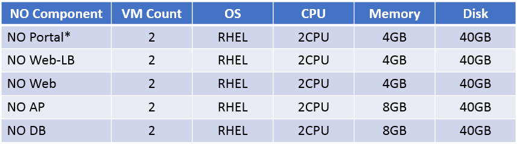

# Network Automation Layer (NAL) Auto Setup Tool

## Overview
This tools is Automation tools for NAL. Installation and Test.

The tool is based on Ansible and Selenium.

## Installation and Usage
The procedures described in this document will show how to setup NAL on a single DC using the NAL-Automation Tool.
In case NAL is planned to be deployed on multiple DC, please contact NAL Support Team (via community forum).

■ REQUIREMENTS 
### 1)  An Ansible Controller Node

Setup and installation of Ansible is not covered in this document.
Please prepare it in advance.

2)  10 VMs for NAL WIM-DC

Recommended VM Configuration:


   
※Number of CPUs allocated using KVM in an environment using Hyper-Threading, two Intel Xeon processors E5-2660v3 (2.6 GHz)

3)  NAL Parameters (TODO)

■ NETWORK CONFIGURATION


■ PREPARATION
1) In the Ansible Controller Node

1-1) It is confirmed that the Ansible Controller Node is able to connect to the NAL VMs.

1-2) Download the installation tool to the ansible home directory (/home/ansible)
<pre># git clone https://github.com/NAL-SupportTeam/NECCS-NAL-Automation.git /home/ansible
# cd /home/ansible
# chown -R ansible:ansible nal</pre>

1-3) Using an editor, update the inventory source file according to NAL parameters
<pre>
# su – ansible
$ vi /home/ansible/nal/hosts.ini</pre>
  [nallbservers]<br/>
  `NAL Web-LB#1 Hostname` ansible_host=`NAL Web-LB#1 SVmng IP Address` is_first_active_node=active index=0<br/>
  `NAL Web-LB#2 Hostname` ansible_host=`NAL Web-LB#2 SVmng IP Address` is_first_active_node=standby index=1<br/>
  <br/>
  [nalwebservers]<br/>
  `NAL Web#1 Hostname` ansible_host=`NAL Web#1 SVmng IP Address` is_first_active_node=active index=0<br/>
  `NAL Web#2 Hostname` ansible_host=`NAL Web#2 SVmng IP Address` is_first_active_node=active index=1<br/>
  <br/>
  [nalapservers]<br/>
  `NAL AP#1 Hostname` ansible_host=`NAL AP#1 SVmng IP Address` is_first_active_node=active index=0<br/>
  `NAL AP#2 Hostname` ansible_host=`NAL AP#2 SVmng IP Address` is_first_active_node=standby index=1<br/>
  <br/>
  [naldbservers]<br/>
  `NAL DB#1 Hostname` ansible_host=`NAL DB#1 SVmng IP Address` is_first_active_node=active index=0<br/>
  `NAL DB#2 Hostname` ansible_host=`NAL DB#2 SVmng IP Address` is_first_active_node=standby index=1<br/>
  <br/>
  [nalfeservers]<br/>
  `NAL FE#1 Hostname` ansible_host=`NAL FE#1 SVmng IP Address` is_first_active_node=active index=0<br/>
  `NAL FE#2 Hostname` ansible_host=`NAL FE#2 SVmng IP Address` is_first_active_node=active index=1<br/>
  ...<br/>

1-4) Using an editor, update the ansible configuration file according to NAL parameters
```
# su – ansible
$ vi /home/ansible/nal/group_vars/all/common.yml
```
**TODO**

1-5) Update the initial data for NAL Database
- Copy and extract the initial data archive for NAL DB into an arbitrary directory.
```
# su – ansible
$ cp –p ~/nal/playbooks/roles/nal_initdb/files/nal-template.tar.gz /tmp/wk.tar.gz
$ cd /tmp
$ tar zxvf wk.tar.gz
```
- Update the values in the following files according to the NAL parameter sheet.
```
/tmp/template/init_NAL_*.sql
/tmp/template/init_WIM_*.sql
```
- Create an archive with the updated files and replace the initial data archive for NAL DB with this one.
```
$ cd /tmp
$ tar -zcvf nal-template.tar.gz template
$ cp –f nal-template.tar.gz ~/nal/playbooks/roles/nal_initdb/files/.
```
1-6) Replace the MSO public key 
```
# su – ansible
$ cd ~/nal/playbooks/roles/nal_nwa/files/
$ scp –p root@<MSO IP Address>:/root/.ssh/id_rsa.pub id_rsa_msa_to_intersec.pub
```
   _NOTE: If MSO public key does not exists, create one._
   
1-7) Get the <userID> of the Ansible User
```
# grep ansible /etc/passwd
ansible:x:1001:1001::/home/ansible:/bin/bash
```

1-8) Get the public key of the “Ansible Controller” Node
```
# cd /home/ansible/.ssh
# cat id_rsa.pub
```

### 2. NAL Components
On each NAL Component VM, perform the following steps

2-1) 
